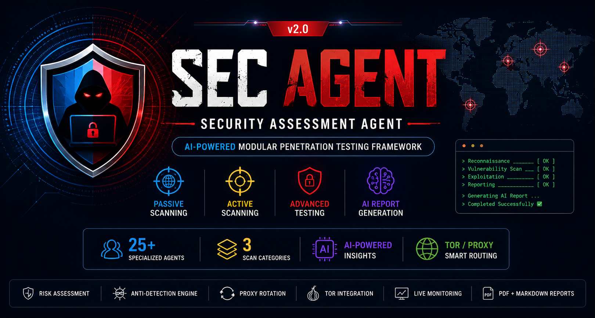

<div align="center">

# 🛡️ Security Assessment Agent v2.0

### *AI-Powered Modular Penetration Testing Framework*

<br>



<br><br>


<br>

**25 Specialized Agents • 3 Scan Categories • AI Reporting • Smart Routing**

<br>

[✨ Features](#-features) •
[⚙️ Installation](#️-installation) •
[🖥️ Usage](#️-usage) •
[🏗️ Architecture](#️-architecture-deep-dive) •
[📁 Reports](#-output-reports)

</div>

---

> ⚠️ **LEGAL DISCLAIMER**
>
> This tool is strictly for **authorized security testing and educational purposes only**.
>
> Unauthorized use against systems you do not own or have **explicit written permission** to test is **illegal** and may violate applicable computer misuse and cybersecurity laws.
>
> **The developers assume zero liability for misuse. Always hack responsibly.**

---

## ✨ Features

<table>
<tr>
<td width="50%">

### 🔍 Scanning Engine

- **25 Specialized Security Agents**
- **3 Scan Categories**
- **Parallel Execution**
- **Per-Agent Timeout Protection**
- **Fresh Session Per Agent**
- **Connection Guard**
- **WAF / 403 Detection**

</td>

<td width="50%">

### 🤖 AI & Reporting

- **Groq AI Powered Analysis**
- **Markdown Reports**
- **PDF Reports**
- **JSON Findings**
- **Fallback Report Engine**
- **Combined Master Summary**

</td>
</tr>

<tr>
<td width="50%">

### 🌐 Smart Connection Routing

- **Direct Connection**
- **Proxy Routing**
- **Tor Routing**
- **Automatic Routing Selection**
- **Proxy Rotation**
- **Tor Session Management**
- **Risk-Based Routing**

</td>

<td width="50%">

### 📊 Live Monitoring

- **CPU Monitoring**
- **RAM Monitoring**
- **Network Statistics**
- **Live Agent Status**
- **Rich Terminal Dashboard**
- **Cross-Platform Support**

</td>
</tr>
</table>

---

## 🔬 Scan Categories

| Category | Type | Agents | Execution | Checks |
|---|---|---:|---|---|
| 🟢 **Category 1** | Passive | 4 | 4 Parallel | DNS, WHOIS, Headers, SSL/TLS, SPF, DKIM, DMARC |
| 🟡 **Category 2** | Active | 7 | 7 Parallel | SQLi, XSS, Path Traversal, CORS, GraphQL, JWT, API |
| 🔴 **Category 3** | Advanced | 14 | 2 Sequential + 12 Parallel | Auth, CMDi, File Upload, SSRF, XXE, NoSQL, SSTI, CSRF, WebSocket, Host Header, Cache, OAuth, Prototype Pollution, IDOR |

---

## 📁 Project Structure

```text
security-scanner-agent/
│
├── app.py
├── monitor.py
├── smart_connection.py
├── connection_guard.py
├── connection_manager.py
├── proxy_manager.py
├── tor_manager.py
├── risk_checker.py
├── anti_track.py
├── platform_utils.py
├── setup.py
├── patch_groq.py
├── .env
├── monitor_logs.txt
│
├── assets/
│   └── sec-agent-banner.png
│
├── tor_portable/
│   ├── torrc
│   └── data/
│
├── category1/
│   ├── core/
│   │   ├── orchestrator.py
│   │   ├── report_generator.py
│   │   └── groq_client.py
│   │
│   ├── agents/
│   │   ├── recon_agent.py
│   │   ├── headers_agent.py
│   │   ├── ssl_agent.py
│   │   └── email_security_agent.py
│   │
│   ├── main.py
│   └── output/
│
├── category2/
│   ├── core/
│   │   ├── orchestrator.py
│   │   ├── report_generator.py
│   │   └── groq_client.py
│   │
│   ├── agents/
│   │   ├── sqli_agent.py
│   │   ├── xss_agent.py
│   │   ├── path_traversal_agent.py
│   │   ├── cors_agent.py
│   │   ├── graphql_agent.py
│   │   ├── jwt_agent.py
│   │   └── api_agent.py
│   │
│   ├── payloads/
│   │   ├── sqli_payloads.txt
│   │   ├── xss_payloads.txt
│   │   └── path_traversal_payloads.txt
│   │
│   ├── main.py
│   └── output/
│
├── category3/
│   ├── core/
│   │   ├── orchestrator.py
│   │   ├── report_generator.py
│   │   └── groq_client.py
│   │
│   ├── agents/
│   │   ├── auth_agent.py
│   │   ├── command_injection_agent.py
│   │   ├── file_upload_agent.py
│   │   ├── ssrf_agent.py
│   │   ├── xxe_agent.py
│   │   ├── nosql_agent.py
│   │   ├── ssti_agent.py
│   │   ├── csrf_agent.py
│   │   ├── websocket_agent.py
│   │   ├── http_host_header_agent.py
│   │   ├── web_cache_agent.py
│   │   ├── oauth_agent.py
│   │   ├── prototype_pollution_agent.py
│   │   └── access_control_agent.py
│   │
│   ├── payloads/
│   │   ├── command_injection_payloads.txt
│   │   ├── xxe_payloads.txt
│   │   ├── nosql_payloads.txt
│   │   ├── ssti_payloads.txt
│   │   └── file_upload_extensions.txt
│   │
│   ├── main.py
│   └── output/
│
└── output/
    ├── category1/
    ├── category2/
    ├── category3/
    ├── *_SUMMARY.md
    └── *_SUMMARY.pdf
⚙️ Installation
Prerequisites
Requirement	Version	Status
Python	3.10+	Required
Groq API Key	—	Required for AI reports
Tor	—	Optional
Clone Repository
git clone https://github.com/yourusername/security-assessment-agent-v2.git
cd security-assessment-agent-v2
Create Virtual Environment
python -m venv venv
Linux / macOS
source venv/bin/activate
Windows PowerShell
.\venv\Scripts\Activate.ps1
Windows CMD
venv\Scripts\activate.bat
Install Dependencies
pip install -r requirements.txt
Configure Groq API

Create:

.env

Add:

GROQ_API_KEY=your_groq_api_key_here
Start Application
python app.py
📦 Dependencies
groq>=0.4.0
reportlab>=4.0.0
colorama>=0.4.6
requests>=2.31.0
beautifulsoup4>=4.12.0
dnspython>=2.4.0
rich>=13.0.0
python-dotenv>=1.0.0
stem>=1.8.0
fake-useragent>=1.4.0
psutil>=5.9.0
websocket-client>=1.6.0
🖥️ Usage

Run:

python app.py

Main menu:

╔══════════════════════════════════════════════════════╗
║          🛡️ Security Assessment Agent v2.0           ║
╠══════════════════════════════════════════════════════╣
║                                                      ║
║   [1]  Category 1 — Passive Scan                     ║
║   [2]  Category 2 — Active Scan                      ║
║   [3]  Category 3 — Advanced Scan                    ║
║   [4]  Full Scan — All Categories                    ║
║   [5]  Cat 1 + 2                                     ║
║   [6]  Cat 1 + 3                                     ║
║   [7]  Cat 2 + 3                                     ║
║   [8]  Custom                                        ║
║                                                      ║
║   [0]  Exit                                          ║
╚══════════════════════════════════════════════════════╝

Connection:
[D] Direct
[P] Proxy
[T] Tor
[A] Auto
🔄 Scan Workflow
Target URL
    │
    ▼
Risk Assessment
    │
    ▼
Smart Connection Setup
    │
    ├── Direct
    ├── Proxy
    └── Tor
    │
    ▼
Anti-Track Engine
    │
    ▼
Connection Guard
    │
    ▼
Parallel Agent Execution
    │
    ▼
Live Dashboard
    │
    ▼
AI Report Generation
    │
    ▼
Markdown / JSON / PDF
    │
    ▼
Combined Master Summary
🌐 Smart Connection Routing
Mode	Description
Direct	Uses the system internet connection
Proxy	Routes supported traffic using configured proxy connections
Tor	Routes supported traffic using Tor
Auto	Chooses a configured route based on risk logic
📊 Live Monitor Dashboard
┌─────────────────────────────────────────────────────────┐
│        🛡️ Security Assessment Agent Monitor             │
├──────────────────┬──────────────────┬───────────────────┤
│ CPU: 42%         │ RAM: 61%         │ Network Active    │
├─────────────────────────────────────────────────────────┤
│ ReconAgent         → Completed                          │
│ HeadersAgent       → Completed                          │
│ SSLAgent           → Completed                          │
│ SQLiAgent          → Running                            │
└─────────────────────────────────────────────────────────┘

Logs:

monitor_logs.txt
📁 Output Reports
Format	Description
.md	Markdown security assessment report
.json	Structured findings
.pdf	PDF assessment report
*_SUMMARY.md	Combined Markdown report
*_SUMMARY.pdf	Combined PDF report

Example:

output/
├── category1/
├── category2/
├── category3/
├── example.com_SUMMARY.md
└── example.com_SUMMARY.pdf
🔎 Finding Structure
{
  "type": "SQL Injection",
  "risk": "HIGH",
  "description": "Potential SQL injection behavior identified during authorized testing.",
  "cvss_score": 9.8,
  "cwe": "CWE-89",
  "evidence": "Relevant request and response behavior recorded by the scanner.",
  "fix": "Use parameterized queries and prepared statements."
}
🏗️ Architecture Deep Dive
Pre-Scan Flow
run_pre_scan_setup(target_url)
        │
        ├── RiskChecker
        │
        ├── AntiTrackManager
        │
        ├── SmartConnection
        │
        └── ConnectionGuard
Agent Execution
Orchestrator
    │
    ├── Agent 1 ───┐
    ├── Agent 2 ───┼── Parallel
    ├── Agent 3 ───┤
    └── Agent N ───┘
          │
          ▼
     all_findings
          │
          ▼
  ReportGenerator
          │
          ├── AI Report
          ├── Markdown
          ├── JSON
          └── PDF
🤝 Contributing

Create a branch:

git checkout -b feature/new-agent

Agent finding structure:

findings = [
    {
        "type": "Vulnerability Name",
        "risk": "HIGH | MEDIUM | LOW | INFO",
        "description": "...",
        "cvss_score": 0.0,
        "cwe": "CWE-XXX",
        "evidence": "...",
        "fix": "..."
    }
]

Add agent to:

categoryX/agents/

Update:

categoryX/core/orchestrator.py
🛡️ Responsible Use

This project is intended for:

Authorized penetration testing
Security labs
CTF environments
Bug bounty programs
Internal security assessments
Cybersecurity education
Security research

Do not scan or attack systems without explicit authorization.

📜 License

This project is licensed under the MIT License.

See:

LICENSE

for more information.

<div align="center">
👨‍💻 Security Assessment Agent v2.0

Built for the Cybersecurity • Ethical Hacking • Bug Bounty community.

🛡️ Hack Responsibly

Always obtain written authorization before testing any system.

<br>


<br><br>

⭐ If this project helps you, consider starring the repository.
</div> ```
